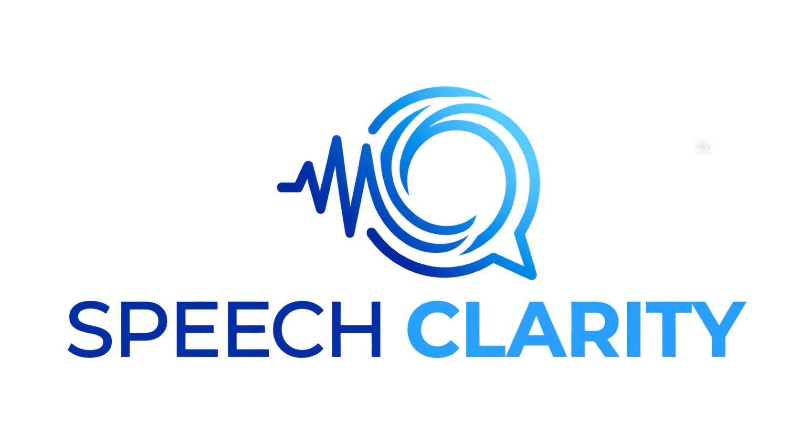
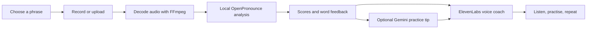

<p align="center">
  
</p>

<h1 align="center">Speech Clarity</h1>
<p align="center"><strong>A little practice. A clearer next take.</strong><br />Built for StormHacks 2026 at Simon Fraser University.</p>

Speech Clarity helps English learners turn “How did I sound?” into a practical next step. Read a phrase, record your voice, explore possible sound differences, and hear a friendly coach explain what to practise next.

The goal is clearer communication while respecting the learner's own voice and accent. The project supports **UN Sustainable Development Goal 4: Quality Education** through guided, repeatable language practice.

## What you can do

- **Practise your own words.** Enter a phrase or start with an everyday example or tongue twister.
- **Listen before speaking.** Play a reference at normal or reduced speed, or hear a clear example of one word.
- **Record your way.** Start and stop manually, use automatic silence stopping, or upload an existing recording.
- **Explore the feedback.** Compare reference and detected sounds, select flagged words, and review sound, word, and reference-similarity estimates.
- **Hear a supportive coach.** ElevenLabs delivers automatic spoken feedback after each take, with optional humour and British, American, or Russian-accented English styles.
- **Get a concrete practice tip.** Gemini uses word-level results to suggest a short next step. Ask the coach to make it simpler, replay the advice, or practise the selected word.
- **Track a practice session.** Compare matching attempts, revisit phrases, download your recording, and export a JSON report of the last 20 takes.

**Coach style and pronunciation reference are separate.** The browser studio currently uses an American English reference. Changing the coach's delivery does not change the scoring target. Russian delivery is prompted and may vary by voice.

## Quick start — Windows

### 1. Install prerequisites

- Git
- Standard Windows CPython **3.10+** (the app has been exercised with Python 3.10)
- **Node.js 24**, including npm
- Windows Package Manager (`winget`) for the setup script's system dependencies

Open a new PowerShell window after installing Node.js so `npm` is available.

### 2. Clone and set up

```powershell
git clone https://github.com/Asky-2759/vigilant-train.git
cd vigilant-train
.\setup.ps1
```

Setup installs FFmpeg and eSpeak NG if needed, creates `.venv`, installs CPU PyTorch and Python dependencies, creates `.env` if it does not exist, and pre-downloads the speech models. Allow time and disk space for approximately **2.4 GB of model downloads**.

To defer model downloads until first use:

```powershell
.\setup.ps1 -SkipModels
```

### 3. Configure the optional services

Edit the root `.env` created by setup:

```dotenv
ELEVENLABS_API_KEY=your_elevenlabs_api_key
GEMINI_API_KEY=your_gemini_api_key
GEMINI_MODEL_ID=gemini-3.8-flash
```

Use the actual ElevenLabs API key, not its key ID. `GOOGLE_API_KEY` is also accepted for Gemini; `GEMINI_API_KEY` takes precedence. Restart the server after changing settings.

| Configuration | Available experience |
| --- | --- |
| No API keys | Recording, local recognition, scoring, written practice suggestions, and online gTTS reference playback |
| ElevenLabs key | Expressive voice coaching and ElevenLabs sentence references |
| Gemini key | Short AI practice tips based on flagged words |
| Both keys | Gemini advice delivered by the automatic ElevenLabs coach |

Keep credentials in `.env`, which is ignored by Git. Never put keys in frontend code.

### 4. Start practising

```powershell
.\run.ps1
```

The launcher installs frontend dependencies if needed, builds the UI, starts the Python server, and opens **http://localhost:8077**. Wait for **Ready when you are**, then choose a phrase and record.

Microphone capture needs browser permission and either localhost or HTTPS. Browser recordings are capped at 30 seconds; uploaded audio can be up to 60 seconds and 25 MB. Automatic mode waits for sound and stops after three seconds of quiet; background noise can trigger it.

**Speak after each take** is on by default. Turn it off for quiet practice. If your browser blocks automatic audio, use **Replay coach**.

### Update an existing checkout

Stop the running server first, then:

```powershell
git pull origin main
.\.venv\Scripts\python.exe -m pip install -r requirements.txt
.\run.ps1
```

## How it works



**Recognition and comparison:** OpenPronounce processes speech locally on the app server. eSpeak NG supplies expected sounds. The combined estimate reflects sound agreement, recognized words, and similarity to reference audio; valid sound variants receive some tolerance. If reference synthesis fails, scoring can continue without that dimension.

**Gemini advice:** Up to six flagged words, with their detected and expected phonetic transcriptions, are sent for a concise practice tip. Recording-quality warnings take priority. No flagged words means no Gemini request. Requests use a 20-second timeout and one attempt; unavailable advice does not discard the recording's score.

**ElevenLabs coaching:** Eleven v3 provides expressive delivery. The coach reads Gemini advice when available and otherwise uses the app's practice guidance. Replay reuses the generated audio. Individual word examples use a separate, spelling-based reference rather than asking a voice to read IPA symbols.

### What the scores mean

Scores are **uncalibrated practice estimates**, not certified language proficiency or a diagnosis. Recognition can miss sounds, and valid accents can be flagged. Compare repeated takes using the same phrase and reference voice; small score changes can be model variation.

Pitch, fluency, rhythm, and word stress are not independently graded. See [SCORING.md](SCORING.md) for the scoring parameters, tolerance rules, and limitations.

## Data and privacy

- Recordings are processed on the machine running the backend. Temporary uploaded and decoded audio files are removed after analysis.
- Speech models download from Hugging Face on first setup/use, then run locally.
- Reference text and spoken coaching text are sent to ElevenLabs, or reference text to gTTS when that voice is used. Synthesized audio is cached locally.
- Gemini receives selected word spellings and detected/expected sounds, **not the raw recording**.
- The browser keeps the last 20 attempt summaries in memory while the practice page stays open. Exported reports contain phrases and scores, not audio.
- API keys stay on the backend. This is a local hackathon prototype; the included server does not provide user accounts or production access controls.

## Development

| Part | Technology |
| --- | --- |
| Interface | React, TypeScript, Vite |
| API | Python, FastAPI, Uvicorn |
| Speech analysis | OpenPronounce, PyTorch, eSpeak NG |
| Audio | Browser MediaRecorder, FFmpeg; sounddevice for the CLI |
| Spoken coaching | ElevenLabs |
| Generated advice | Gemini via Google GenAI |

After running setup, use the frontend development launcher:

```powershell
cd frontend
npm ci
npm run dev
```

It starts Vite and starts the backend if one is not already available. Open the URL printed by Vite. For backend reload while serving the built UI, use `.\run.ps1 -Reload` from the repository root.

### Checks

Run from the repository root:

```powershell
npm --prefix frontend ci
npm --prefix frontend run build
node --test frontend/tests/capture.test.mjs frontend/tests/session.test.mjs
.\.venv\Scripts\python.exe -m pip install httpx
.\.venv\Scripts\python.exe -m unittest discover -s tests
```

Tests cover recorder cleanup across repeated takes, cancellations and device errors, session comparisons, upload handling, coaching, and Gemini failure fallback. They do not replace testing a real microphone or evaluating pronunciation accuracy with human listeners.

### Repository guide

| Path | Purpose |
| --- | --- |
| `frontend/src/pages/Practice.tsx` | Recording, feedback, coaching, and session UI |
| `frontend/src/lib/capture.ts` | Browser recording lifecycle |
| `backend/app.py` | API routes and built frontend hosting |
| `backend/scoring.py` | OpenPronounce integration and result shaping |
| `backend/coach.py` | Coaching scripts and voice selection |
| `backend/elevenlabs.py` | Speech synthesis and audio caching |
| `ai_advice.py` | Gemini pronunciation advice |
| `backend/settings.py` | Environment configuration |
| `tests/` and `frontend/tests/` | Backend and frontend checks |
| `SCORING.md` | Scoring details and limitations |

## Troubleshooting

| Symptom | What to try |
| --- | --- |
| `npm.cmd` is not recognized | Install Node.js with npm, reopen PowerShell, and check `node --version` and `npm --version`. |
| Studio stays on model preparation | First use downloads large models. Check the server terminal and internet connection; warm the app before a demo. |
| FFmpeg or eSpeak NG is missing | Run setup and restart the terminal. Check the paths reported by the backend. |
| No microphone audio | Allow microphone access, use localhost or HTTPS, check the selected system input, and try manual mode. |
| Coach does not play automatically | Press **Replay coach**. Check **Speak after each take** and the ElevenLabs key/credits. |
| Gemini advice is unavailable | Check the Gemini key and model setting, restart, and try again later. Provider errors leave ordinary feedback available. |
| Voice or key settings did not change | Restart the Python server; settings are loaded at startup. |

## Standalone microphone workflow

The repository also includes the original microphone-to-WAV practice tools:

```powershell
.\.venv\Scripts\python.exe practice.py --keep-audio
```

Choose automatic or manual recording and a reference accent. Manual mode uses Enter to start and stop. Both modes cap capture at 30 seconds and produce 16 kHz mono, 16-bit PCM WAV files. `--keep-audio` saves takes in `recordings/`; without it, temporary audio is deleted after the attempt.

`audio_recorder.py` records audio, `speech_to_ipa.py` recognizes sounds, and `comparison.py` compares phone sequences. This CLI comparator reports strict sequence differences; it is separate from the browser studio's scoring and coaching workflow.

## Built together

Speech Clarity combines our team's recording, pronunciation comparison, frontend, and AI coaching work for StormHacks 2026. The Gemini integration builds on the team's `frontend-testing` branch. See the [contributors](https://github.com/Asky-2759/vigilant-train/graphs/contributors) and commit history for individual contributions.
